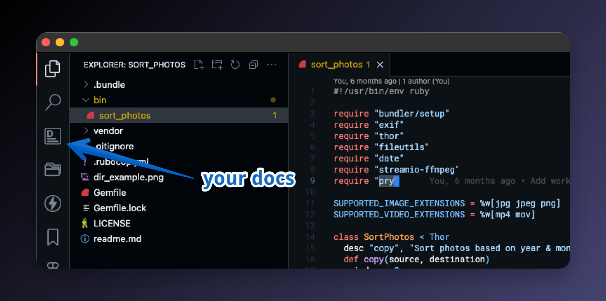
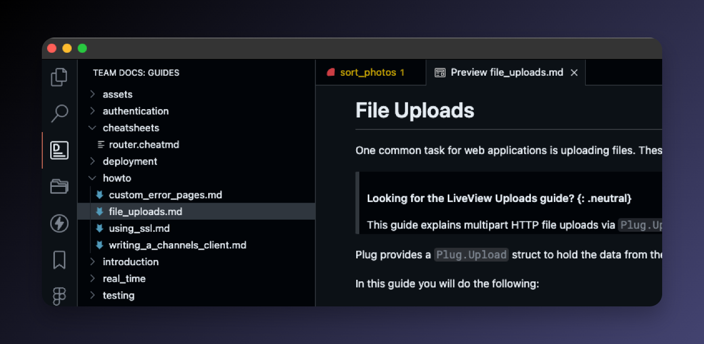
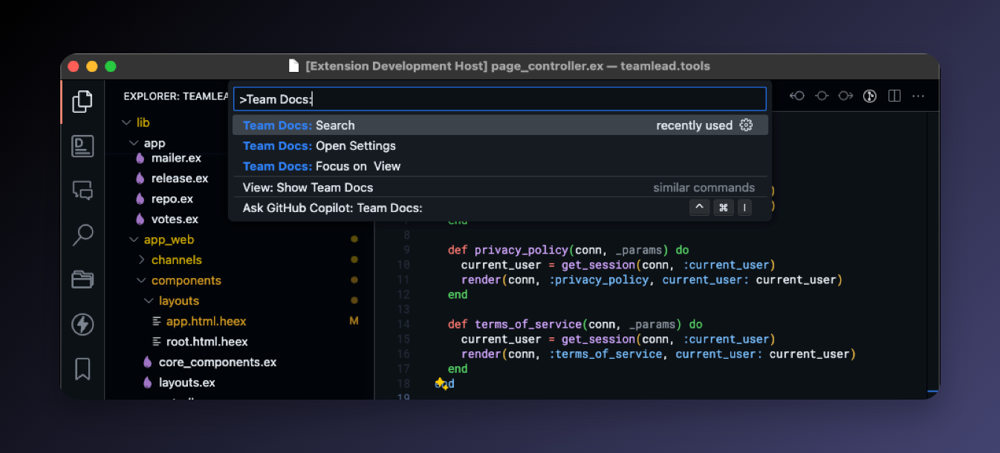
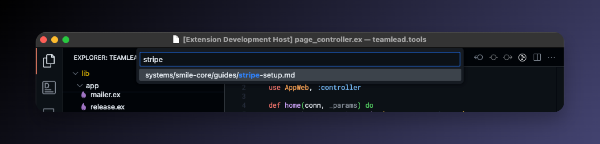
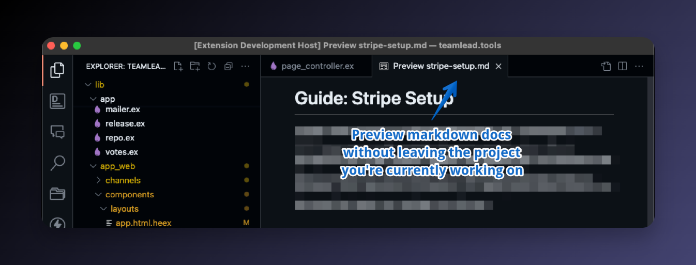

# TeamDocs

[TeamDocs](https://marketplace.visualstudio.com/items?itemName=lucasprag.teamdocs&ssr=false#overview) keeps your team's centralized documentation one click away in the Activity Bar — no matter which project you're working on.

Point it at any folder of Markdown files (e.g. a checked-out docs repo) and TeamDocs gives you a dedicated explorer and a quick-pick search, so you never have to leave your current project to look something up.

## Features

### 1. Browse your docs from the Activity Bar

A dedicated **Team Docs** icon is added to the Activity Bar. Click it to see the full folder tree of your documentation, regardless of which project is open in VS Code.

- The view title is automatically set to the name of your docs folder.
- Folders are listed before files, and entries are sorted alphabetically.
- Files and folders matching VS Code's `files.exclude` setting are hidden automatically (e.g. `.git`, `node_modules`).

### 2. Open Markdown as a rendered preview

Clicking any Markdown file in the explorer opens the **rendered Markdown preview** directly — not the raw source. Non-Markdown files (images, PDFs, code, etc.) open with their default editor.

Supported Markdown extensions: `.md`, `.markdown`, `.mdown`, `.mkdn`, `.mkd`, `.mdwn`, `.mdtxt`, `.mdtext`, `.text`.

### 3. Quick search across all docs

Run **`Team Docs: Search`** from the command palette (or click the search icon at the top of the Team Docs view) to fuzzy-find any file in your docs folder without leaving your current project.

1. Run the command `Team Docs: Search` — or click the 🔍 button in the Team Docs view header.

2. Type to filter files by name or path.

3. Hit Enter — Markdown files open as a rendered preview, everything else opens normally.

### 4. Works across every project

TeamDocs reads from a single, globally configured docs folder — so the same documentation is available in every workspace you open. There's no per-project setup.

## Commands

| Command | Description |
| --- | --- |
| `Team Docs: Search` | Fuzzy-find and open a file from your docs folder. |
| `Team Docs: Open Settings` | Jump straight to the TeamDocs configuration. |

## Extension Settings

| Setting | Description |
| --- | --- |
| `teamdocs.path_to_docs_folder` | Absolute path to the folder containing your team's documentation. Supports `~` and `${HOME}` expansion. Example: `~/Docs/engineering`. |

If this setting is empty, TeamDocs will prompt you to configure it the first time you open the view.

TeamDocs also honors your VS Code `files.exclude` setting to filter what shows up in both the explorer and the search results.

## Getting started

1. Install **TeamDocs** from the Marketplace.
2. Clone or point to a folder containing your team's Markdown documentation.
3. Open VS Code settings and set `teamdocs.path_to_docs_folder` to that folder (e.g. `~/Docs/engineering`).
4. Click the **Team Docs** icon in the Activity Bar — your docs are now available in every project.

## Check out my other extensions

TeamDocs is one of a few VS Code extensions I build and maintain. You can find the full list — along with the projects and articles I'm working on — at [lucasprag.com](https://lucasprag.com/).

**Thank you**
